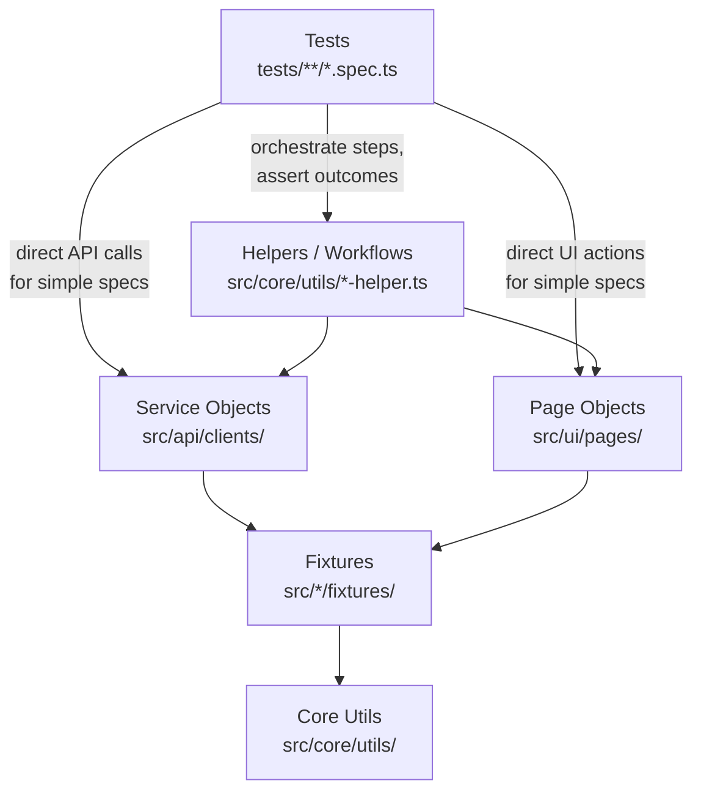

# Insurity EAIS Automation Framework


A production-grade test automation suite for **Insurity EAIS (Enterprise AI Suite) — Pod 3**, covering the **Rules Engine** and **Rating Engine** microservices. Built on Playwright + TypeScript, the framework provides full API and UI coverage with multi-role authentication, encrypted credential management, and end-to-end Azure DevOps Test Plans integration including automatic evidence capture and result publishing.

[Quick Start](#4-getting-started) · [Architecture](#2-architecture) · [CI/CD](#9-cicd-integration) · [Contributing](#13-contributing-guidelines)

---

## Table of Contents

1. [Framework Overview](#1-framework-overview)
2. [Architecture](#2-architecture)
3. [Folder Structure](#3-folder-structure)
4. [Getting Started](#4-getting-started)
5. [Configuration](#5-configuration)
6. [Test Data Strategy](#6-test-data-strategy)
7. [Running Tests](#7-running-tests)
8. [Reporting & Evidence](#8-reporting--evidence)
9. [CI/CD Integration](#9-cicd-integration)
10. [ADO Integration Deep-Dive](#10-ado-integration-deep-dive)
11. [Best Practices](#11-best-practices)
12. [Scalability Recommendations](#12-scalability-recommendations)
13. [Contributing Guidelines](#13-contributing-guidelines)

---

## 1. Framework Overview

### What This Framework Automates

| Domain | Microservice | Coverage |
|---|---|---|
| Rules Engine | `RULES_URL` | Create, deploy, evaluate, audit, version, roll back rules |
| Rating Engine | `RATING_ENGINE_URL` | Rate plans, formulas, occurrences, leap-year calc, policy data |

Both domains are tested via **REST API** (primary) with select **UI** coverage via Playwright browser automation.

### Why Playwright + TypeScript

- **Unified runner** — API (`APIRequestContext`) and browser (`Page`) tests share one framework, one config, and one report
- **Type safety** — TypeScript catches contract mismatches between service clients and test data at compile time
- **Built-in retry** — `retries: 1` on CI plus service-level retry with exponential backoff for 429 rate limits
- **Trace Viewer** — full DOM/network/console capture on first retry, no video overhead
- **Rich reporters** — JUnit XML (CI), HTML report (local), custom ADO reporter (test plan sync)

### Key Capabilities

- **Multi-role authentication** — Admin, Underwriter, Agent, Viewer sessions pre-authenticated in global setup
- **Multi-environment** — QA and Staging via `.env` overlay pattern; switch with `TEST_ENV=staging`
- **Encrypted credentials** — AES-256-GCM `ENC:` format; passwords can be committed safely
- **ADO Test Plans sync** — automatic TC ID resolution, result publishing, and evidence upload
- **Evidence capture** — per-test-case request/response JSON and screenshots in `test-results/evidence/`
- **PostgreSQL testing** — singleton connection pool for test prerequisite setup and cleanup
- **Report archival** — every run auto-saved as a timestamped ZIP in `reports/`
- **Teams notifications** — build outcome posted to a Teams webhook on every CI run

---

## 2. Architecture

The framework is organised into strict layers. Each layer has one responsibility and may only depend on the layers below it. This prevents test logic from leaking into utilities and keeps service clients free of assertion code.



### Layer Responsibilities

| Layer | Does | Must NOT Do |
|---|---|---|
| **Tests** | Orchestrate steps, make `expect()` assertions | Contain request construction, locator logic |
| **Helpers** | Combine multiple service calls into reusable workflows | Make assertions; import other helpers |
| **Service Objects** | Wrap one API endpoint set; handle retry/backoff | Import test fixtures, make UI actions |
| **Page Objects** | Define locators; expose action methods | Call `expect()`, import service objects |
| **Fixtures** | Provide typed test context (auth, DB pool, ADO IDs) | Contain business logic |
| **Core Utils** | Encryption, date ops, RBAC, state, data factories | Import from layers above |

> **Dependency rule:** Imports always point downward. A service object may import a util; a util must never import a service object.

---

## 3. Folder Structure

```
.
├── src/
│   ├── api/
│   │   ├── clients/              # Service Objects — one class per microservice domain
│   │   │   ├── common/
│   │   │   │   └── BaseApiService.ts   # Retry, logging, JSON:API envelope handling
│   │   │   ├── rules/            # Rules Engine service clients
│   │   │   └── rating/           # Rating Engine service clients
│   │   └── fixtures/
│   │       └── api.fixture.ts    # Provides: request (APIRequestContext)
│   ├── ui/
│   │   ├── pages/                # Page Object Model classes
│   │   │   ├── BasePage.ts       # Shared navigation/loading waits
│   │   │   ├── common/           # LoginPage, NavigationPage
│   │   │   └── rules/            # Domain-specific pages
│   │   └── fixtures/
│   │       └── ui.fixture.ts     # Provides: authenticatedPage (Page), testData
│   ├── db/
│   │   ├── client/
│   │   │   └── pool.ts           # Singleton pg.Pool (max 5 connections)
│   │   └── fixtures/
│   │       └── db.fixture.ts     # Provides: db (Pool)
│   └── core/
│       ├── config/
│       │   └── env.ts            # loadEnv(), activeEnv(), requireEnv()
│       ├── fixtures/
│       │   ├── tc-fixture.ts     # ADO annotation hook (useSuiteAnnotations)
│       │   └── test.ts           # Merged fixture — single import for all tests
│       ├── logger/
│       │   └── index.ts          # Shared API call logger
│       └── utils/
│           ├── crypto-utils.ts   # AES-256-GCM encrypt/decrypt, resolveSecret()
│           ├── rbac.ts           # Role → auth file mapping + permission matrix
│           ├── StateManager.ts   # Cross-worker JSON-on-disk state
│           ├── test-data-factory.ts  # TestDataFactory (Faker.js-backed)
│           └── ...               # date-utils, string-utils, response-validator, etc.
│
├── tests/
│   ├── pod3-rules/
│   │   ├── api/                  # Rules Engine API spec files (suite*.spec.ts)
│   │   └── ui/                   # Rules Engine browser spec files
│   └── pod3-rating/
│       └── api/                  # Rating Engine API spec files
│
├── integrations/
│   └── ado/
│       ├── ado-test-case-reader.ts   # Fetches test cases from ADO Test Plans API
│       ├── ado-test-result-writer.ts # Writes outcomes to ADO Test Plans API
│       ├── reporters/
│       │   ├── ado-tc-reporter.ts    # Playwright reporter: builds evidence JSON
│       │   └── report-archiver.ts    # Playwright reporter: auto-archives runs
│       └── scripts/
│           ├── fetch-testcases.ts    # Pre-run: ADO → test-data/*.json
│           └── push-from-report.ts  # Post-run: results JSON → ADO Test Plans
│
├── test-data/
│   ├── ado-cases-pod3-{suiteId}.json  # Pre-fetched ADO test case metadata
│   └── tc-map-pod3-{suiteId}.json     # Manual TC tag → ADO ID override maps
│
├── scripts/
│   └── encrypt-credentials.ts    # Generate ENCRYPTION_KEY and ENC:... values
│
├── .auth/                         # Browser auth state (git-ignored, auto-generated)
│   ├── admin.json
│   ├── underwriter.json
│   └── agent.json
│
├── test-results/                  # Test run artefacts (git-ignored)
│   ├── junit-results.xml
│   ├── ado-tc-report.json
│   └── evidence/
│
├── playwright-report/             # Latest HTML report (git-ignored)
├── reports/                       # Archived timestamped reports (git-ignored)
├── global-setup.ts                # Pre-authenticates all roles before test run
├── playwright.config.ts           # Projects, reporters, timeouts, worker count
├── azure-pipelines.yml            # 4-stage CI/CD pipeline definition
├── .env                           # Environment variables (git-ignored)
├── SETUP.md                       # Step-by-step local environment setup
└── ONBOARDING.md                  # New-joiner walkthrough guide
```

### TypeScript Path Aliases

| Alias | Resolves To | Use For |
|---|---|---|
| `@services/*` | `src/api/clients/*` | Service object imports |
| `@pages/*` | `src/ui/pages/*` | Page object imports |
| `@fixtures/*` | `src/core/fixtures/*`, `src/api/fixtures/*`, `src/db/fixtures/*` | Fixture imports |
| `@utils/*` | `src/core/utils/*` | Utility imports |
| `@core/*` | `src/core/*` | Core config and logger |
| `@api/*` | `src/api/*` | API layer imports |
| `@ui/*` | `src/ui/*` | UI layer imports |
| `@db/*` | `src/db/*` | DB layer imports |

---

## 4. Getting Started

### Prerequisites

| Requirement | Version | Notes |
|---|---|---|
| Node.js | 18.x | `node --version` to verify |
| npm | 9.x+ | Bundled with Node 18 |
| Playwright Browsers | Chromium | Installed via `npx playwright install` |
| Access | ADO PAT + app credentials | See SETUP.md |

> **Full environment setup:** Follow [SETUP.md](SETUP.md) for `.env` file creation, credential encryption, and first-run verification.

### Run Your First Test

```bash
# 1. Install dependencies
npm ci

# 2. Install Playwright browsers
npx playwright install --with-deps

# 3. Copy the env template and fill in your values
cp .env.example .env

# 4. Run the full Pod 3 Rules suite against QA
npm run test:pod3:qa

# 5. Open the HTML report
npm run report
```

---

## 5. Configuration

All configuration lives in `.env` files at the project root. **Never commit `.env` to git** — it is in `.gitignore`. Use `.env.example` as the template.

### Environment Variable Reference

#### Application URLs

| Variable | Description | Example |
|---|---|---|
| `BASE_URL` | Main application base URL | `https://eais-qa.insurity.com` |
| `RULES_URL` | Rules Engine microservice base URL | `https://rules-qa.insurity.com` |
| `RATING_ENGINE_URL` | Rating Engine microservice base URL | `https://rating-qa.insurity.com` |
| `TEST_ENV` | Active environment (`qa` or `staging`) | `qa` |

#### Credentials (per role)

| Variable | Description |
|---|---|
| `ADMIN_USERNAME` / `ADMIN_PASSWORD` | Admin role credentials |
| `UNDERWRITER_USERNAME` / `UNDERWRITER_PASSWORD` | Underwriter role credentials |
| `AGENT_USERNAME` / `AGENT_PASSWORD` | Agent role credentials |
| `VIEWER_USERNAME` / `VIEWER_PASSWORD` | Viewer role credentials (optional) |

Passwords support the `ENC:` encrypted format — see [Credential Encryption](#credential-encryption) below.

#### Database

| Variable | Description |
|---|---|
| `DB_HOST` | PostgreSQL host (often in `.env.qa`) |
| `DB_PORT` | PostgreSQL port (default `5432`) |
| `DB_NAME` | Database name |
| `DB_USER` | Database username |
| `DB_PASSWORD` | Database password (supports `ENC:` format) |

#### Azure DevOps

| Variable | Description |
|---|---|
| `ADO_ORG_URL` | `https://dev.azure.com/<your-org>` |
| `ADO_PAT` | Personal Access Token (Test Management read+write) |
| `ADO_PROJECT` | ADO project name (e.g., `Insurity EAIS AIDLC`) |
| `ADO_PLAN_ID_POD3` | Test plan numeric ID for Pod 3 |
| `ADO_SUITE_ID_POD3` | Root suite numeric ID for Pod 3 |

#### Notifications

| Variable | Description |
|---|---|
| `TEAMS_WEBHOOK_URL` | Incoming Webhook URL for the build-results Teams channel |
| `ENCRYPTION_KEY` | 64-character hex key for AES-256 credential encryption |

### Credential Encryption

Passwords can be stored in encrypted form so they are safe to commit (with the encryption key itself kept in a secrets vault).

```bash
# Generate a new encryption key (do this once per environment)
npm run encrypt:creds -- --generate-key
# → ENCRYPTION_KEY=<64-hex-chars>  ← add to .env

# Encrypt a password value
npm run encrypt:creds -- --value "mySecretPassword"
# → ENC:<iv>:<authTag>:<ciphertext>  ← use as the *_PASSWORD value in .env
```

The framework's `resolveSecret()` utility automatically detects and decrypts `ENC:` prefixed values at runtime. Plain-text values pass through unchanged.

### Multi-Environment Overlay Pattern

`TEST_ENV` controls which overlay file is loaded on top of the base `.env`:

```
.env            ← loaded always (credentials, ADO, Teams)
.env.qa         ← loaded when TEST_ENV=qa  (DB_HOST, DB_NAME, URLs)
.env.staging    ← loaded when TEST_ENV=staging
```

Switch environment at runtime:

```bash
TEST_ENV=staging npm run test:pod3
# or use the shorthand script
npm run test:pod3:staging
```

---

## 6. Test Data Strategy

The framework uses a three-layer data model to ensure tests are isolated, repeatable, and free of hardcoded values.

### Layer 1 — Factory-Generated (Faker.js)

`TestDataFactory` generates unique, realistic data on every run. No two runs share the same entity IDs or names.

```typescript
import { TestDataFactory } from '@utils/test-data-factory';

const factory = new TestDataFactory();

// Build a rule payload with defaults
const ruleData = factory.buildRule();

// Override specific fields
const ratingRule = factory.buildRule({ ruleType: 'RATING', isEnabled: false });

// Build user credentials for a role (reads from .env via resolveSecret)
const adminUser = factory.buildUser('admin');
// → { username: 'admin@insurity.com', password: '<decrypted>' }
```

### Layer 2 — Environment-Sourced (Credentials)

Role credentials are read from `.env` via `resolveSecret()`, which transparently decrypts `ENC:` values. This layer is the only place credentials should ever appear in code.

### Layer 3 — ADO Pre-Fetched (Test Case Metadata)

`test-data/ado-cases-pod3-{suiteId}.json` files contain ADO test case metadata (IDs, titles, steps). They are generated once with:

```bash
npm run fetch:testcases
```

Re-run this command when ADO test cases are added or renamed. The files are committed to the repo so CI does not need ADO access at test-run time.

`tc-map-pod3-{suiteId}.json` files are hand-authored overrides that explicitly map a TC tag (e.g., `TC-AI-001`) to an ADO work item ID. Use these when auto-resolution fails for a specific test.

### Cross-Worker State (StateManager)

When a `beforeAll` block creates a shared resource that parallel Playwright workers need, use `StateManager`:

```typescript
import { StateManager } from '@utils/StateManager';

// In beforeAll
const state = new StateManager('suite18178');
state.set('ruleId', createdRule.id);   // written to disk

// In any test (any worker)
const ruleId = state.get<string>('ruleId');
```

State is stored as JSON on disk so all workers can read it regardless of process isolation.

### Cleanup Strategy

| Scenario | Cleanup Mechanism |
|---|---|
| Cross-worker state | `state.clear()` in `afterAll` |
| Database rows inserted by tests | `dbCleanup('rules', { name: ruleName })` in `afterAll` |
| Ordered test chains | Use `test.describe.serial()` — cleanup runs at end of chain |
| API-created entities | `DELETE` call in `afterAll` via service object |

---

## 7. Running Tests

### NPM Scripts

| Script | Command | Description |
|---|---|---|
| `test` | `npm test` | Run all tests (default env) |
| `test:qa` | `npm run test:qa` | Run all tests against QA |
| `test:staging` | `npm run test:staging` | Run all tests against Staging |
| `test:pod3` | `npm run test:pod3` | Run all Pod 3 Rules Engine tests |
| `test:pod3:qa` | `npm run test:pod3:qa` | Pod 3 Rules against QA |
| `test:pod3:staging` | `npm run test:pod3:staging` | Pod 3 Rules against Staging |
| `test:smoke` | `npm run test:smoke` | Run `@smoke`-tagged tests only |
| `test:smoke:qa` | `npm run test:smoke:qa` | Smoke tests against QA |
| `report` | `npm run report` | Open the Playwright HTML report |
| `fetch:testcases` | `npm run fetch:testcases` | Refresh ADO test case JSON files |
| `push:report` | `npm run push:report` | Push results to ADO Test Plans |
| `encrypt:creds` | `npm run encrypt:creds` | Encrypt a credential value |

### Run a Specific Suite

```bash
# By Playwright project name (defined in playwright.config.ts)
npx playwright test --project=pod3-suite-18178

# By file path
npx playwright test tests/pod3-rules/api/suite18178.spec.ts

# By test title pattern
npx playwright test --grep "Verify creating a rule"

# By tag
npx playwright test --grep "@smoke"
```

### Run Against a Specific Environment

```bash
TEST_ENV=staging npx playwright test --project=pod3-suite-18178
```

### Available Playwright Projects

| Project Name | Matches | Base URL |
|---|---|---|
| `pod3-rules` | All `tests/pod3-rules/**` | `RULES_URL` |
| `pod3-suite-18178` | `suite18178.spec.ts` | `RULES_URL` |
| `pod3-suite-18180` | `suite18180.spec.ts` | `RULES_URL` |
| `pod3-suite-18181` | `suite18181.spec.ts` | `RULES_URL` |
| `pod3-suite-18186` | `suite18186.spec.ts` | `RULES_URL` |
| `pod3-suite-18187` | `suite18187.spec.ts` | `RULES_URL` |
| `pod3-suite-18191` | `suite18191.spec.ts` | `RULES_URL` |
| `pod3-suite-19725` | `suite19725.spec.ts` | `RULES_URL` |
| `pod3-suite-18177` | `suite18177.spec.ts` | `RATING_ENGINE_URL` |
| `pod3-suite-18303` | `suite18303.spec.ts` | `RATING_ENGINE_URL` |
| `pod3-suite-18304` | `suite18304.spec.ts` | `RATING_ENGINE_URL` |
| `pod3-suite-18306` | `suite18306.spec.ts` | `RATING_ENGINE_URL` |
| `pod3-suite-18307` | `suite18307.spec.ts` | `RATING_ENGINE_URL` |
| `pod3-suite-20009` | `suite20009.spec.ts` | `RATING_ENGINE_URL` |
| `smoke` | All `@smoke` tagged tests | `BASE_URL` |

---

## 8. Reporting & Evidence

### Report Artifacts

| Artifact | Location | Description |
|---|---|---|
| **Playwright HTML Report** | `playwright-report/index.html` | Interactive report with step timeline, screenshots, traces |
| **JUnit XML** | `test-results/junit-results.xml` | CI-consumable XML for Azure Pipelines Test Results tab |
| **ADO TC Report** | `test-results/ado-tc-report.json` | Machine-readable JSON consumed by `push:report` script |
| **Evidence Files** | `test-results/evidence/` | Per-test-case `.txt` and `.json` files with full API logs |
| **Archived Reports** | `reports/{label}_{date}_{time}/` | Auto-saved timestamped copy of every run |

### View the HTML Report

```bash
npm run report
# Opens playwright-report/index.html in your default browser
```

### View the Trace Viewer

Traces are captured on the **first retry** of any failing test. Open them from the HTML report (click a failed test → Traces tab) or directly:

```bash
npx playwright show-trace test-results/<test-name>/trace.zip
```

The trace viewer shows a full DOM snapshot, network waterfall, console logs, and every action with timing.

### Push Results to ADO Test Plans (Manual)

After a local run, publish results and evidence to ADO:

```bash
npm run push:report
```

This script reads `test-results/ado-tc-report.json`, creates a test run in ADO, patches each test case outcome (Pass/Fail/Blocked), and uploads the evidence JSON as a comment on the test case work item.

### Report Archival

The `report-archiver` Playwright reporter runs automatically after every test run. It copies the full `playwright-report/` folder to `reports/{label}_{date}_{time}/` and creates a ZIP. No manual steps needed.

---

## 9. CI/CD Integration

The pipeline is defined in `azure-pipelines.yml` and runs on Azure Pipelines with an `ubuntu-latest` agent.

### Pipeline Stages

```
Install → Pod3_Rules → PushToADO → Notify
```

| Stage | Depends On | Condition | What It Does |
|---|---|---|---|
| **Install** | — | Always | `npm ci` + `npx playwright install --with-deps`; publishes workspace as artifact |
| **Pod3_Rules** | Install | Always | Runs `npm run test:pod3`; publishes JUnit results and HTML report; `continueOnError: true` |
| **PushToADO** | Pod3_Rules | `succeeded()` | Runs `npm run push:report`; maps outcomes to ADO Test Plans with evidence |
| **Notify** | PushToADO | `always()` | Posts green (success) or red (failure) Teams card via webhook |

### Trigger Conditions

| Trigger | Target | Behaviour |
|---|---|---|
| Push | `main`, `develop` | Runs full pipeline |
| Pull Request | `main` | Runs full pipeline as PR gate |
| Nightly schedule | `main` | Runs daily at 02:00 UTC (`0 2 * * *`), even if no changes |

### Variable Groups

Secrets and config are stored in Azure Pipelines Library variable groups — never hardcoded in the YAML.

| Group | Contains |
|---|---|
| `insurity-secrets` | `ADO_PAT`, `ADMIN_PASSWORD`, `UNDERWRITER_PASSWORD`, `AGENT_PASSWORD`, `DB_PASSWORD`, `TEAMS_WEBHOOK_URL`, `ENCRYPTION_KEY` |
| `insurity-config` | `RULES_URL`, `RATING_ENGINE_URL`, `BASE_URL`, `DB_HOST`, `DB_PORT`, `DB_NAME`, `DB_USER`, `ADO_ORG_URL`, `ADO_PROJECT`, `ADO_PLAN_ID_POD3`, `ADO_SUITE_ID_POD3` |

### Adding a New Test Stage

To add a new pod or service to the pipeline:

1. Copy the `Pod3_Rules` stage block in `azure-pipelines.yml`
2. Change the `name`, `displayName`, and the `npm run test:XXX` script reference
3. Update `dependsOn` in the `PushToADO` stage to include the new stage
4. Add any new service-specific env vars to the `insurity-config` variable group

---

## 10. ADO Integration Deep-Dive

### How TC IDs Are Resolved

The framework links each Playwright test to an ADO work item using a 5-tier resolution chain (highest to lowest priority):

1. **`@TC<id>` Playwright tag** in the test title string — e.g., `[TC-AI-001] @TC17340 Verify...`
2. **`tc-map-pod3-{suiteId}.json`** — hand-authored explicit overrides (use when auto-resolution fails)
3. **Numeric parse** — if the test title contains a pattern like `TC-17461`, the number is extracted directly
4. **`ado-cases-pod3-{suiteId}.json` lookup by `tcTag`** — matches on the `TC-AI-001` style tag
5. **`ado-cases-pod3-{suiteId}.json` lookup by title substring** — last resort, matches partial titles

The first tier that returns a valid numeric ADO case ID wins.

### Annotating Tests with ADO IDs

Every test file calls `useSuiteAnnotations` in a `beforeEach` hook to stamp the four required ADO annotations:

```typescript
import { useSuiteAnnotations } from '@utils/ado-annotations';

// At the top of a describe block (suiteId, planId)
useSuiteAnnotations(18178, 123456);
```

This automatically adds to every test:
- `TestCaseID` — the TC tag from the test title (e.g., `TC-AI-001`)
- `ADO_CaseID` — the resolved numeric ADO work item ID
- `ADO_SuiteID` — the suite number
- `ADO_PlanID` — the test plan number

### Pre-Run → Post-Run Workflow

```
Before first run (once, or when ADO test cases change):
  npm run fetch:testcases
  → Fetches all test cases from ADO Test Plans API
  → Writes test-data/ado-cases-pod3-{suiteId}.json
  → Commit these files (CI uses them without needing live ADO access)

After each test run:
  npm run push:report
  → Reads test-results/ado-tc-report.json
  → Creates a test run in ADO Test Plans
  → Patches Pass/Fail/Blocked outcome per test case
  → Uploads evidence JSON as a comment on each work item
```

### Updating `tc-map-pod3-*.json`

When a test cannot be auto-resolved (new test with no matching title in ADO, or title changed), add an explicit entry to the relevant map file:

```json
{
  "TC-AI-015": 17499,
  "TC-AI-016": 17500
}
```

Where the key is the `TC-AI-XXX` tag in the test title and the value is the numeric ADO work item ID.

---

## 11. Best Practices

### Test Title Naming Convention

```
[TC-AI-{NNN}] @TC{adoId} Verify {business outcome} when {condition}
```

Example:

```typescript
test('[TC-AI-001] @TC17340 Verify creating a rule returns 201 with Draft status', async () => {
```

- `TC-AI-{NNN}` — sequential tag scoped to the suite; used for ADO lookup
- `@TC{adoId}` — explicit ADO work item ID; overrides all auto-resolution tiers
- Title starts with `Verify` — describes the observable outcome, not the implementation step

### What Goes Where

| Code | Belongs In | Never In |
|---|---|---|
| `expect()` assertions | Tests, helpers | Page objects, service objects, fixtures |
| Locators and `click()` / `fill()` | Page objects | Tests (directly), service objects |
| HTTP requests (`GET`, `POST`, etc.) | Service objects | Page objects |
| Multi-step reusable flows | Helpers | Tests (if used 2+ times) |
| Test setup/teardown | Fixtures, `beforeAll`/`afterAll` | Inline in test body |
| Credentials / environment values | `.env` + `resolveSecret()` | Hardcoded anywhere |

### Parallel vs Serial Execution

```typescript
// Use serial ONLY when tests have explicit ordering dependencies
test.describe.serial('LIFECYCLE — Rule CRUD', () => {
  test('Create rule', ...);      // sets state for the next test
  test('Read rule', ...);        // depends on previous
  test('Delete rule', ...);      // cleanup
});

// Default: parallel — Playwright runs test files concurrently
// No test.describe.serial needed for independent tests
```

### Evidence Annotations

Attach evidence to every significant API interaction for ADO publishing:

```typescript
test.info().annotations.push({
  type: 'Evidence',
  description: `Created rule id=${rule.id} status=${rule.status}`,
});
```

Use `description` (not `value`) — Playwright only renders `description` in the HTML report.

### Never-Do List

| Never | Why |
|---|---|
| Hardcode test data values | Tests become brittle and environment-dependent |
| Use CSS selectors or XPath | Breaks on style/markup changes; use `getByRole`, `getByLabel`, `getByTestId` |
| Call `expect()` inside a page object | Page objects are actions — assertions belong in tests |
| Commit `.env`, `.auth/`, or `test-results/` | Credentials and run artifacts are git-ignored for security |
| Use `test.only()` on a shared branch | Blocks CI from running other tests |
| Import upward (utils importing services) | Breaks the dependency rule; causes circular imports |

---

## 12. Scalability Recommendations

### Adding a New Microservice

1. **Create a service class** in `src/api/clients/{domain}/`:

   ```typescript
   // src/api/clients/underwriting/UnderwritingService.ts
   import { BaseApiService } from '@services/common/BaseApiService';

   export class UnderwritingService extends BaseApiService {
     async create(payload: CreatePolicyPayload) {
       return this.post<Policy>('/api/v1/policies', payload);
     }
   }
   ```

2. **Export from the fixture** — add to `src/api/fixtures/api.fixture.ts` alongside existing services
3. **Add tests** under `tests/pod{N}-{domain}/api/suite{suiteId}.spec.ts`
4. **Add a Playwright project** in `playwright.config.ts` with the correct `testMatch` and `baseURL`
5. **Add a pipeline stage** in `azure-pipelines.yml` (copy-paste `Pod3_Rules`, update env vars and script)

### Adding a New Environment

1. Create `.env.{envname}` with environment-specific overrides (DB host, service URLs)
2. Add `npm run test:{envname}` to `package.json`: `"cross-env TEST_ENV={envname} playwright test"`
3. Create an `insurity-config-{envname}` variable group in Azure Pipelines Library
4. Add an optional pipeline stage or YAML parameter to target the new environment

### Adding a New Role

1. Add role credentials to `.env`: `NEWROLE_USERNAME`, `NEWROLE_PASSWORD`
2. Add the role to the RBAC matrix in `src/core/utils/rbac.ts`
3. Add the role entry to `AUTH_STORAGE_PATH`: `newrole: '.auth/newrole.json'`
4. Add the authentication step in `global-setup.ts` (copy an existing role block)
5. Run `global-setup.ts` once locally to generate `.auth/newrole.json`

### Worker Count & Sharding

```typescript
// playwright.config.ts
workers: process.env.CI ? 2 : undefined,
// Local: uses CPU count (auto)
// CI: 2 workers — conservative for shared agents; increase if agent has spare capacity
```

For very large suites (100+ tests), use Playwright sharding across parallel CI agents:

```bash
# Shard 1 of 3
npx playwright test --shard=1/3

# Shard 2 of 3
npx playwright test --shard=2/3
```

### When to Refactor Serial → Parallel

Refactor a `test.describe.serial()` block to parallel when:

- Each test can create its own test data with `TestDataFactory` (no shared state needed)
- The resource created in `beforeAll` can be scoped to `beforeEach` without significant cost
- Parallel execution would meaningfully reduce total suite run time

---

## 13. Contributing Guidelines

### Branch Naming

| Type | Pattern | Example |
|---|---|---|
| New feature / test suite | `feature/<ticket>-<short-desc>` | `feature/18200-rate-plan-api` |
| Bug fix | `fix/<ticket>-<short-desc>` | `fix/18178-null-rule-id` |
| Chore / tooling | `chore/<desc>` | `chore/update-playwright-1.45` |

### Pull Request Checklist

Before opening a PR, verify:

- [ ] `npm run test:pod3:qa` passes locally with no hardcoded data
- [ ] All new tests follow the `[TC-AI-{NNN}] @TC{adoId}` title format
- [ ] ADO work item IDs are mapped (either via `@TC` tag or `tc-map-pod3-*.json`)
- [ ] `npm run fetch:testcases` was re-run if new ADO test cases were added
- [ ] No `.env`, `.auth/`, `test-results/`, or `playwright-report/` files staged
- [ ] New service classes extend `BaseApiService`
- [ ] No `expect()` calls inside page objects or service objects
- [ ] TypeScript compiles cleanly: `npx tsc --noEmit`

### Generating and Encrypting New Credentials

When onboarding a new environment or rotating a password:

```bash
# Step 1: Generate a new encryption key (if not already set)
npm run encrypt:creds -- --generate-key

# Step 2: Encrypt the new password
npm run encrypt:creds -- --value "newSecretPassword"
# Output: ENC:<iv>:<authTag>:<ciphertext>

# Step 3: Set in .env
ADMIN_PASSWORD=ENC:<iv>:<authTag>:<ciphertext>

# Step 4: Store the ENCRYPTION_KEY in Azure Pipelines Library (insurity-secrets group)
```

### Code Review Expectations

- **Service objects:** verify retry logic is inherited from `BaseApiService`, not reimplemented
- **Test assertions:** verify they test business outcomes, not implementation details
- **Test data:** verify all values come from `TestDataFactory` or env — no literals
- **ADO annotations:** verify `useSuiteAnnotations` is called in every new spec file

> **New to the codebase?** Start with [ONBOARDING.md](ONBOARDING.md) for a full guided walkthrough of the framework patterns, fixture system, and writing your first test end-to-end.

---

*Framework maintained by the Insurity EAIS QA Automation team. Raise issues or feature requests via ADO or Teams.*
